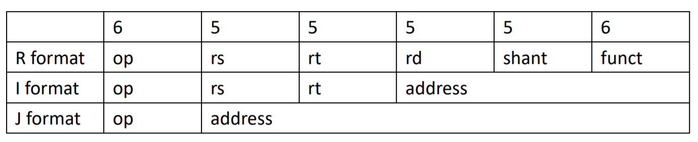

# assembler
## 記憶體儲存
已知記憶體儲存: msb <-> lsb
* Big Endian  
lower address <-> higher address  
依照位置來存，符合直覺，MIPS 使用該存法。  
* Small Endian  
higher address <-> lower address  
好處左而右都是由大到小，但是數字超過 1B，Bytes 要由右而左，且之中的 bit 右由左而右看。
* MIPS 存法  
MSB  low adderss  
^  
|  
v  
LSB  high address  
## 設計 MIPS 三大原則  
* 有規律且簡單  
ex: 儲存運算分開  
* 小而快  
ex: register 小而快速，mem 輔助大小。  
* 越常用越快  
ex: addi  
## 遞迴  
* callee
存 ra(自己的，中途會不見)、s0(caller 的)。  
復原 s0、ra。  
jr $ra。  
* caller
存 t0、a0。  
換成 callee 的 a0。  
jal callee(更新 ra)。  
復原 t0、a0。  
* sp  
存在 sp。  
由於存法由高到低(stack)，所以先位移(減)幾位(addi -4*i)。  
再由小而大存。  
> dynamic data，由低到高，與 stack 相遇 則為 overflow。  
  
> $fp ，存 MSB 端。
* syscall  
\$v0 函式代號。  
$a0 參數。
## Basic Blocks
不管中間怎麼跑，進去出來都一樣。  
## Format
  
* R format  
``(op:funct) rd rs rt``  
Ex. add、sub、slt、and、or ...  
  
``(op:funct) rd rt shamt``  
Ex. sll、srl ...  
  
``(op:funct) rs``  
Ex. jr  
  
* I format  
``(op) rt rs immediate(constant、address)``  
Ex. addi、beq、bne、lw、sw ...  
  
* J format  
Ex. j、jal  
  

