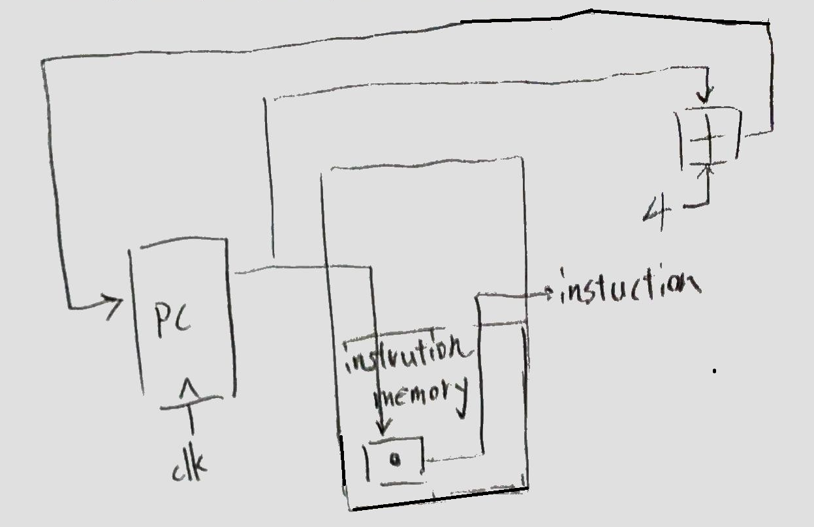
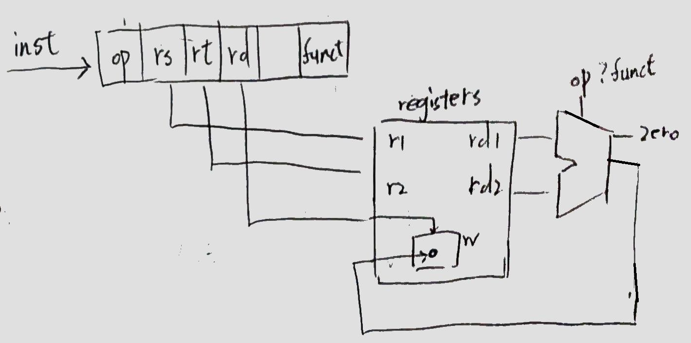
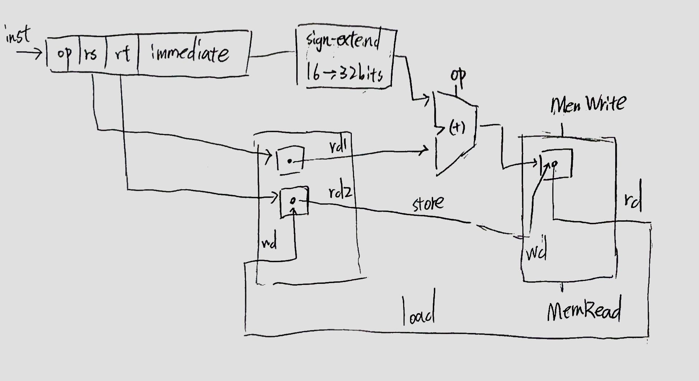
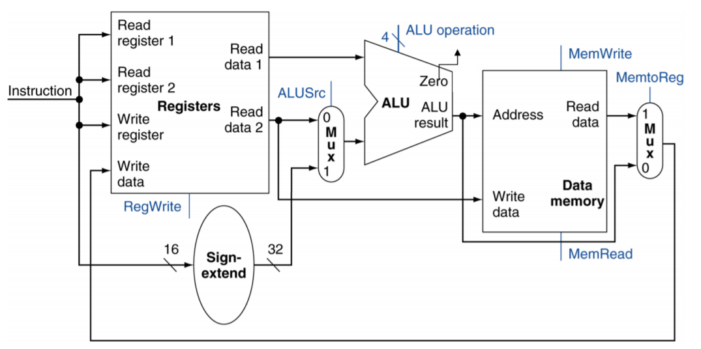
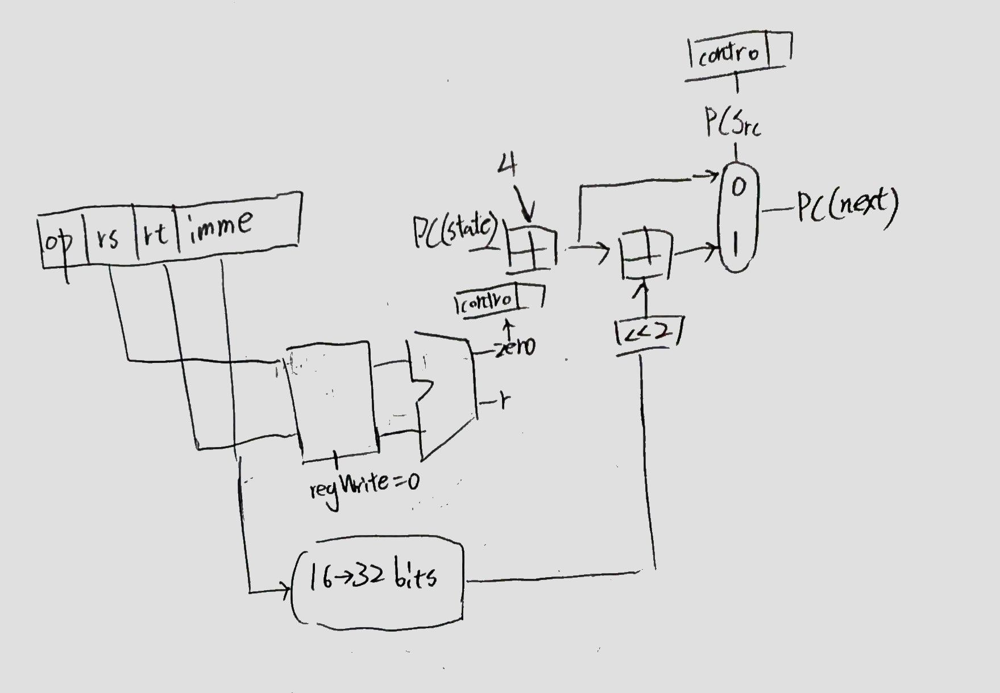
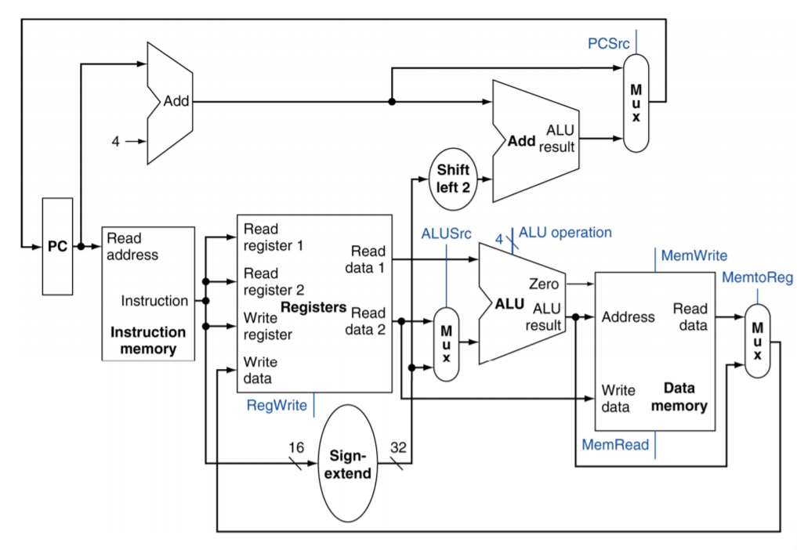

# Datapath  
這裡只舉 single-cycle  
## register  
R0~R31, PC, HI, LO (不按順序)。
## Instruction Fetch  

## R-format (rd = rs ? rt)

## load/store

## R/load/store
* rd2 是記憶體的值 或 ALU 運算值。
* ALU 運算值是 rd1 和 (rd2 或 imme)。
* ALU result 會指向記憶體取結果 或 直接當結果。  

## branch  

## R/load/store/branch  
* 是否寫入 reg、mem。  
* imme 多一個加到 PC 的分支。  
