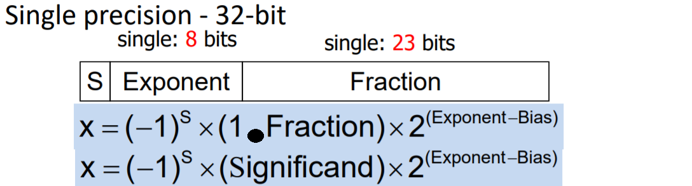
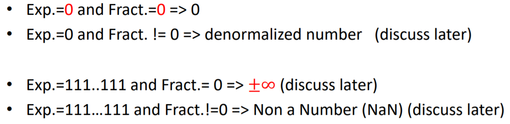
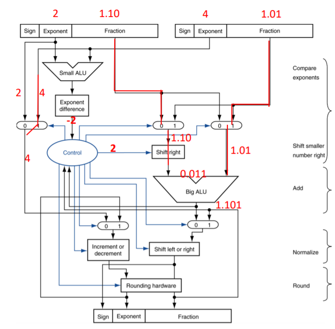
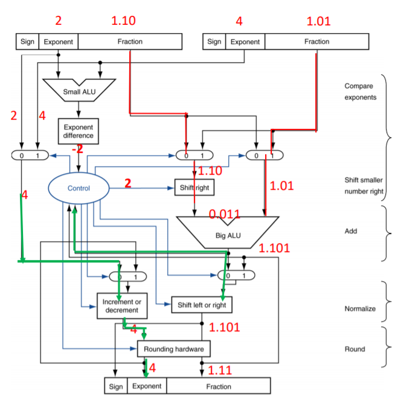

# Float  
  
bias = 2^8-1。  
## IEEE 754  
  
## denormalized  
原則上單精度浮點最小只能是 2^-127 次，但我們捨棄這個表示，讓 8 個 0 跟 00000001 一樣是 2^-126，但是 hidden bit 是 0，也就能表示更小的數。  
* normalized 最小是 2^-126
* denormalized 最小是 2^-126 * 2^-23。
## 加法  
* 對齊  
將指數小的移到指數大的，有可能 underflow，但反過來移可能會 overflow。  
* 運算  
* normalized  
將齊表示乘科學記號。
* check overflow、underflow
* round  
將過程中 underflow 的 bits 補上。  
* renormalized if need  
## 乘法  
* 指數相加  
* 運算(之後同上)
## 無連鎖率  
由於會 underflow  
## 正確率  
在對齊之前，多三個 bits 在數字後，分別是 Guard, Round and Sticky。 
* Guard, Round  
算完後，G == 1，進位。  
* Sticky  
表示很小的數非 0。
  
算完不儲存。  
## 加法器舉例  
  
  