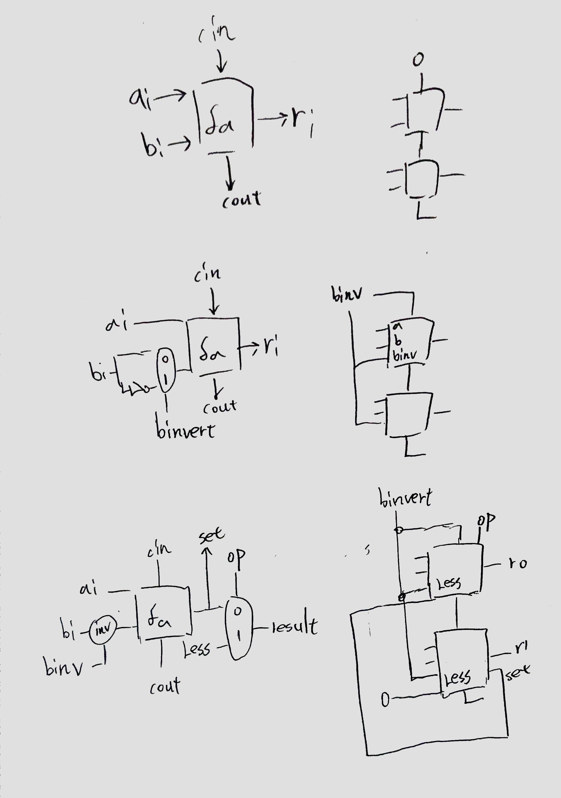
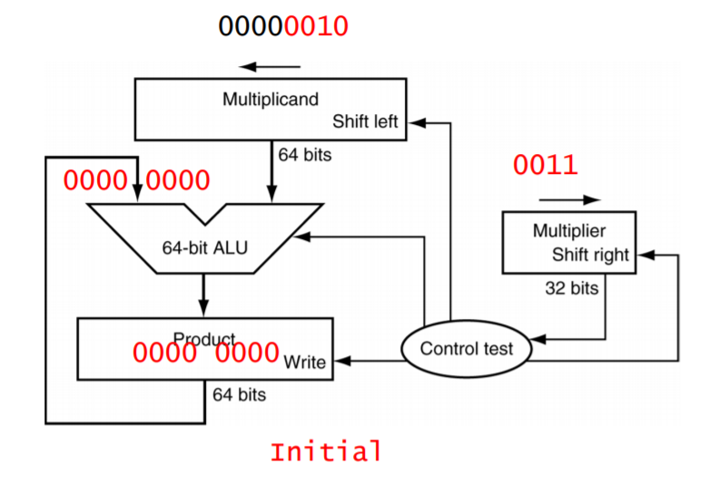
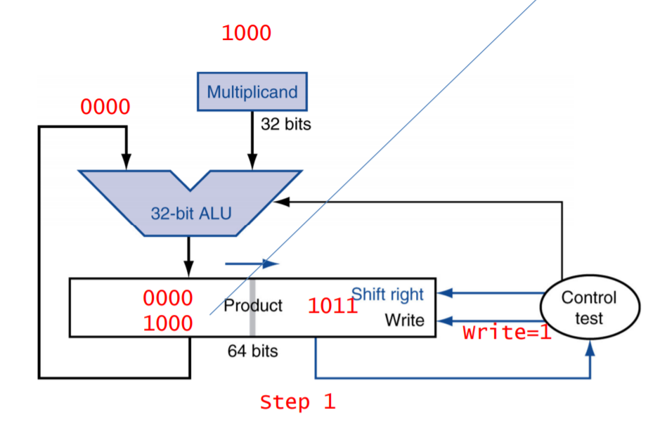
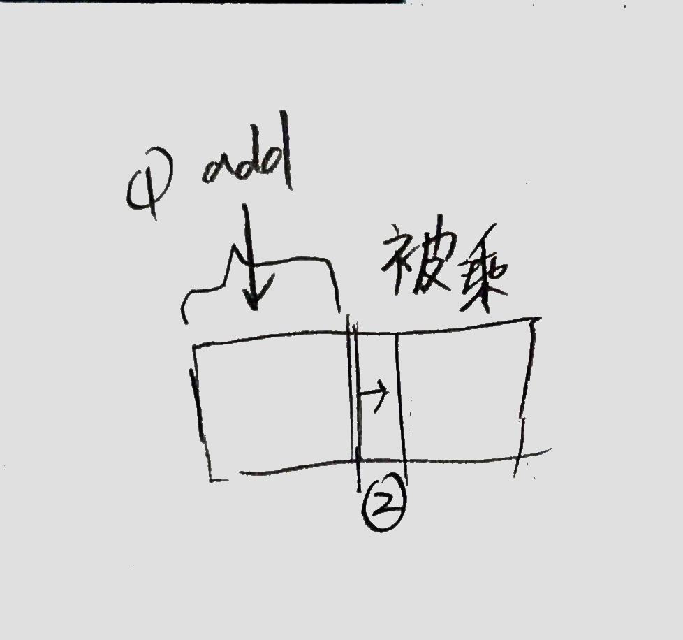
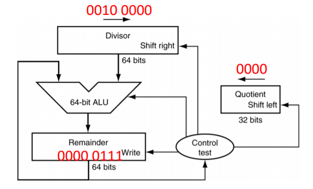
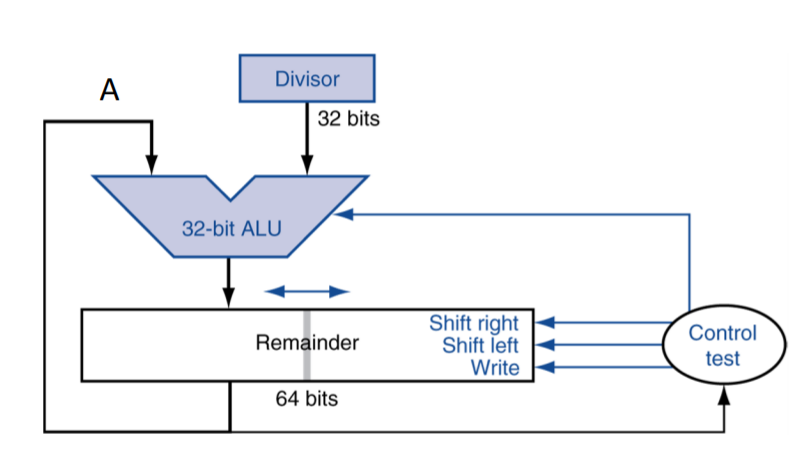
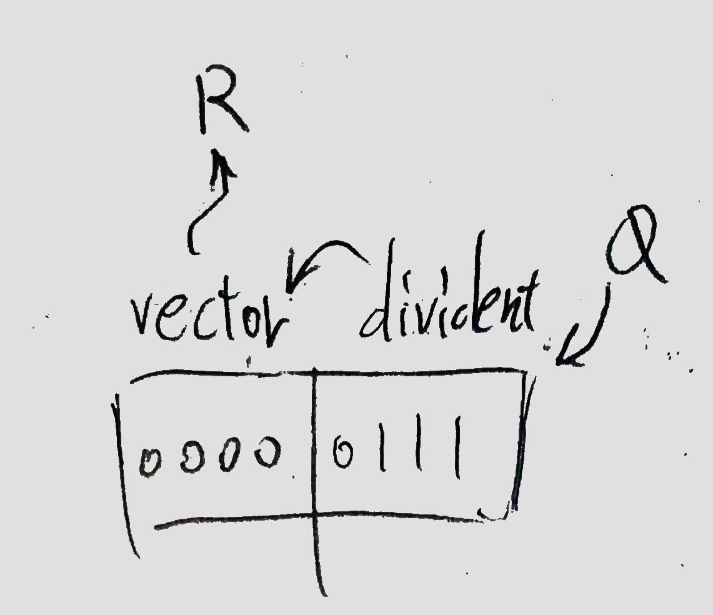

# Arighmetic Logic Unit  
基本上就是透過 multiplexer 實作多種運算。  
舉 加減、and、or、slt(i) 的 ALU 為例。  
會有一個輸出是 nor(result)，判斷 0。  
## full adder  
全加器經修改能算減法，甚至 slti。

## overflow  
舉四位為例，若 overflow，cout4 xor cout3 為 1。  
slti 的結果會相反。  
* handle  
當 overflow ，該指令的 count 存在 EPC (exception program counter)，也就是 (\$R14 in Coprocessor 0)
move from CoProc 0 (MFC0)，將該指令的 count 移到 $reg。  
jr $reg 即可處理該指令。  
具體作法不明。  
## 32 bits乘法器  
* 法1  
如同寫直式，乘數左移，被乘數右移。  
  
Write=1 會把 Product + Multiplicant 的值更新到 Product。  
32bits 卻要用 64bits 執行，效果不好。  
* 改良  
可將積往左補位(算直式的順序是由右而左)，乘數右移。  
  
  
由示意圖得被乘數會往右邊加。
最後成數消失，被乘數占滿 64bits。  
## 32 bits除法器  
* 法1  
因為商是從最高位開始得，所以把除數提到最大(<<32)，拿去減被除數，為負再復原，最後被除數會是餘數。  
  
Write 不知道要幹嘛。  
* 改良  
如同寫直式，將被除數從左而右移到 vector，再用除數減減看，新商再補到最右邊(整個要先左移)。  
  
  
## 乘除法結果  
會再 `{HI, LO}` 裡。
`mfhi rd` 或 `mflo rd` 可取得結果。
* 乘法  
`{HI, LO} = product`  
* 除法  
`{HI, LO} = {R, Q}`
## 更快的電路
* 加法  
用 lookahead，cin 不透過前者的 cout。  
* 乘法  
用 merge。