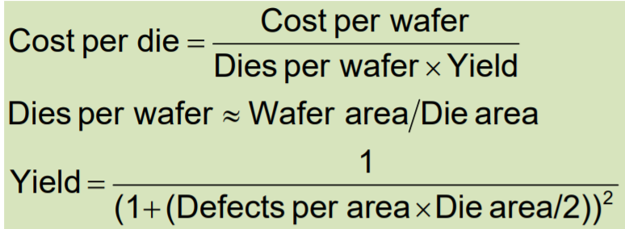
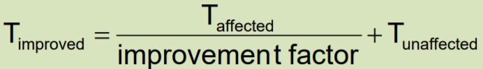
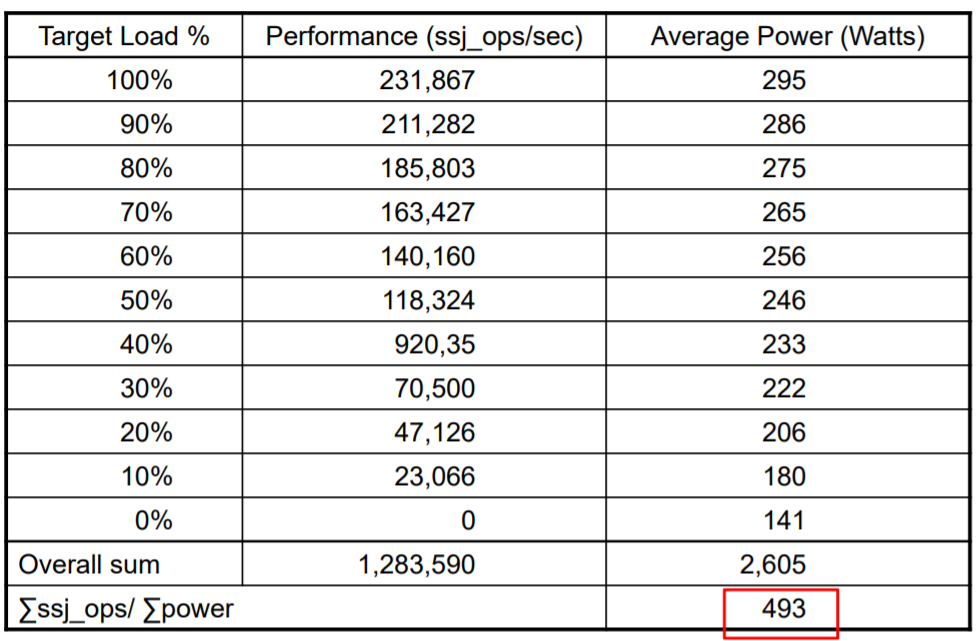

# Performance  
## cost
wafer 切割成多個 die

## time
* response time  
使用者輸入到輸出時間。
* throughput  
單位時間吞吐量。
* Relative Performance  
完成時間倒數。
## cpu time  
* CPI  
有時會有權重。
* MIPS
* ISAs  
Instruction set architecture
## power  
1/2 * cv^2 * f。
## Multiprocessors
* Multicore microprocessors  
一核二序。
* parallel programming  
多工編程。
* Instruction level parallelism  
讓單處理序實現多工。
## SPEC Ratio
relative performance 的 幾何平均。
* Benchmark  
跑分
## Amdahl’s Law

## SPECpower_ssj2008 for X4  

選一個好的 target load。
## Abstractions
讓我們能用高階語言讓電腦做事
* Architecture  
指令集
* Implementation  
讓硬體實現指令集。